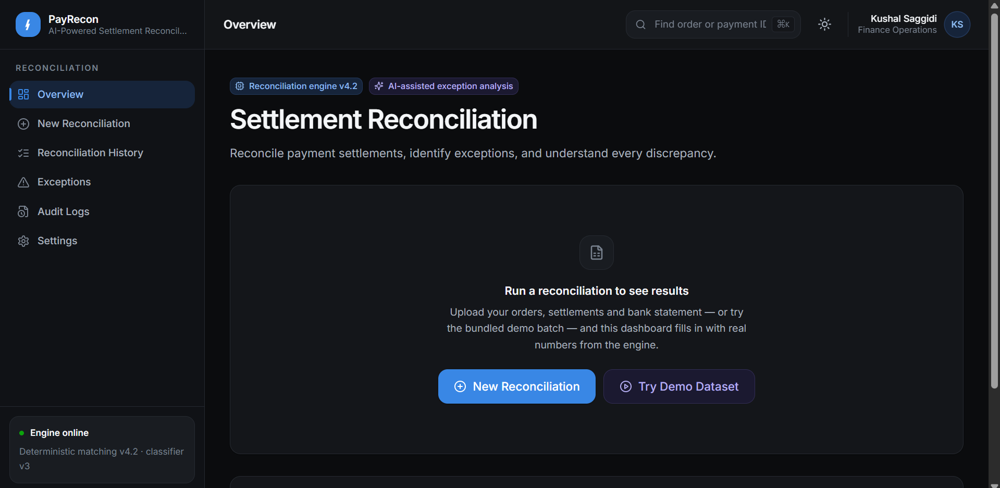
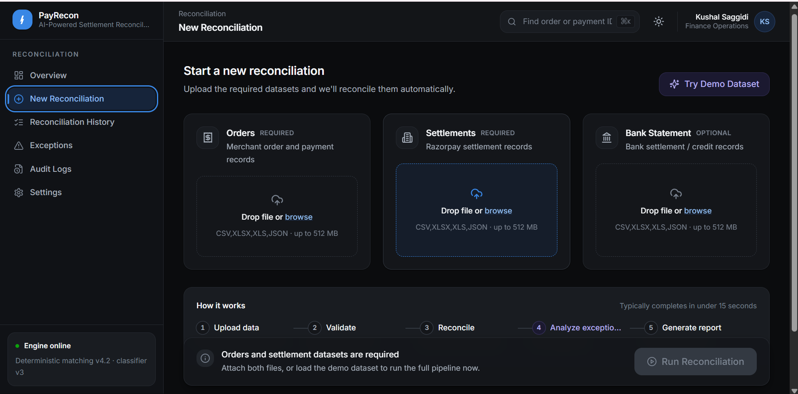
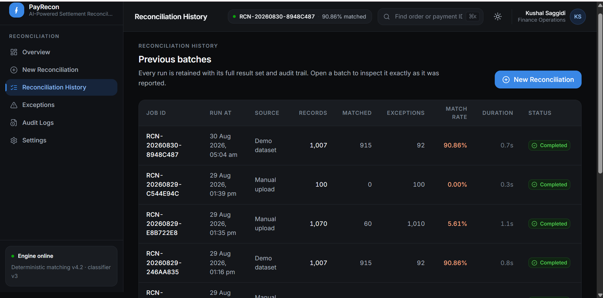
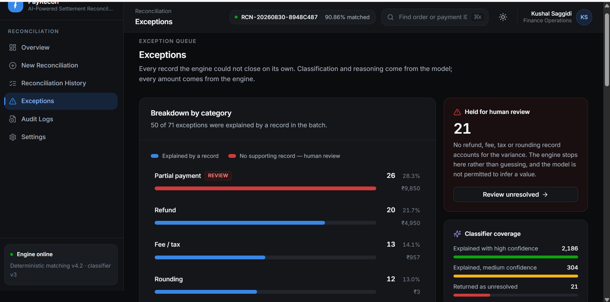
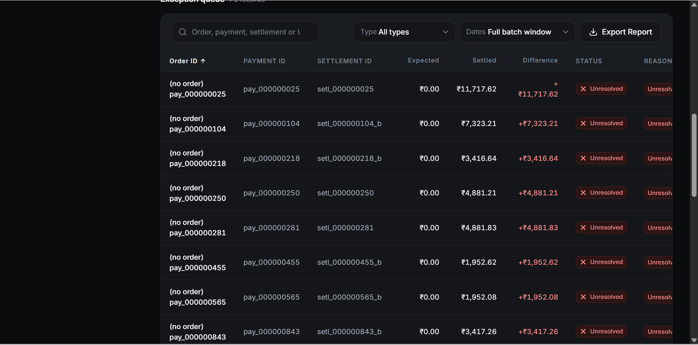
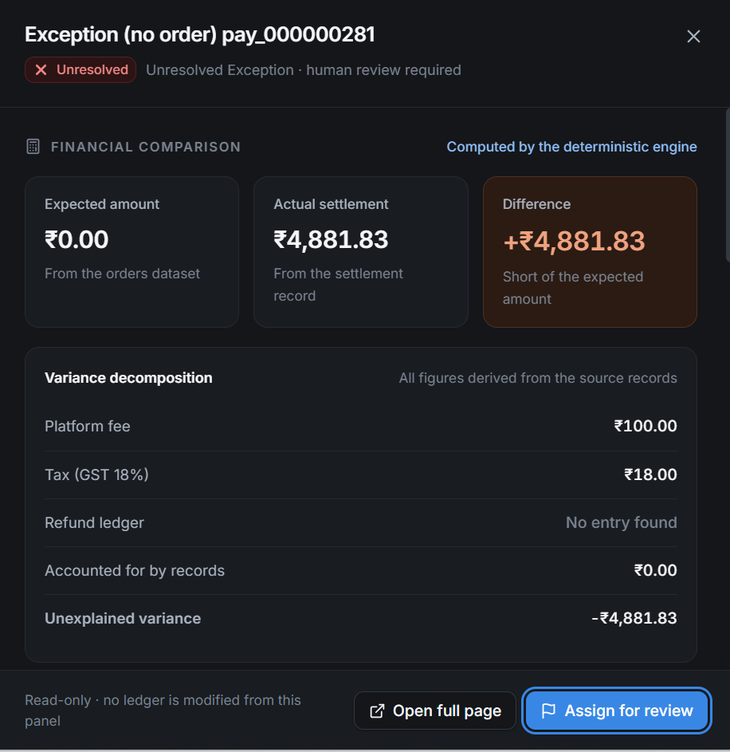
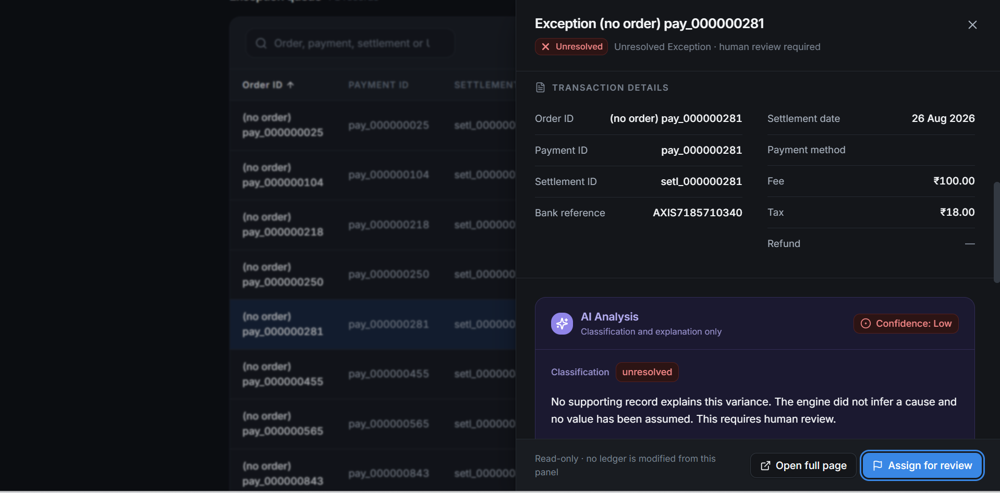
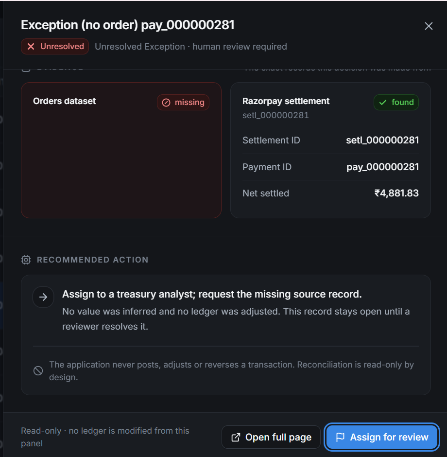
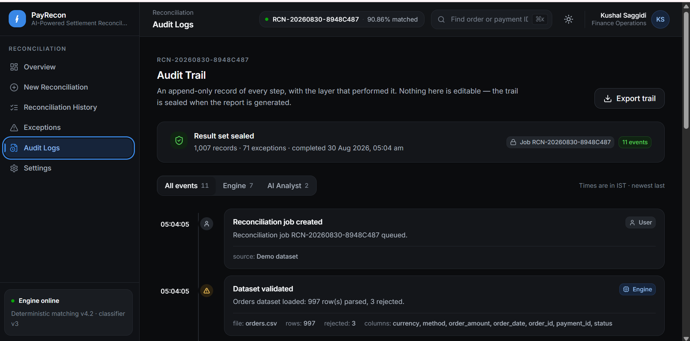
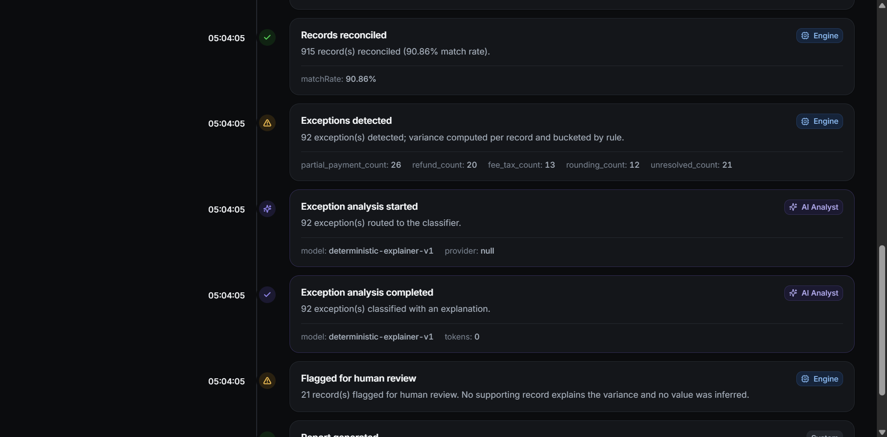

# PayRecon — AI-Powered Settlement Reconciliation Agent

A deterministic three-way settlement reconciliation engine (Orders ↔ Razorpay
Settlements ↔ Bank Statement) with an advisory AI layer for exception
classification. Built for a Razorpay AI hackathon; designed to scale from
hundreds of records to millions without rewriting the core logic.

**The one rule everything else follows:** Python computes every financial
figure — matching, joins, fees, tax, refunds, variance, all metrics. The LLM
only classifies and explains exceptions that the deterministic engine already
computed. It never does arithmetic, never matches records, and a failure in it
can never fail a job or change a number.

---

## Product tour

**Overview** — live KPIs (match rate, exceptions, variance) the moment a batch
finishes, with one click to load the bundled demo dataset if you don't have
your own files handy.



**New Reconciliation** — drop in Orders + Settlements (Bank Statement is
optional); the five-stage pipeline (Upload → Validate → Reconcile → Analyze
exceptions → Generate report) typically finishes in under 15 seconds.



**Reconciliation History** — every run is retained with its full result set,
so a batch can be reopened and inspected exactly as it was reported.



**Exceptions** — every record the deterministic engine couldn't close on its
own, broken down by category. The engine draws the line between "explained by
a record" and "no supporting record — human review"; the model never gets to
move that line.




**Exception detail** — the financial comparison and variance decomposition are
computed by the engine (labelled as such); the AI layer only classifies and
explains, always with a confidence score, and can flag a record for human
review but never clear one.





**Audit Logs** — an append-only trail of every step, tagged by the layer that
performed it (Engine vs. AI Analyst), sealed once the report is generated.




---

## Architecture

```
Upload (CSV / XLSX / XLS / JSON)
   │
   ▼
INGESTION        app/ingestion/     format + dataset-type detection, flexible
   │                                 column mapping, chunked reads, per-row
   │                                 validation, never silently drops a row
   ▼
NORMALIZATION    app/ingestion/normalizer.py
   │                                 ₹1,000 / 1,000 / 1000.00 -> integer paise,
   │                                 dates, currencies, IDs (123456.0 -> "123456")
   ▼
RECONCILIATION   app/reconciliation/  hash-indexed joins (O(n), never O(n²)),
   ENGINE                            configurable settlement equation,
   │                                 deterministic exception rules
   ▼
MATCHED /        MATCHED | EXCEPTION | UNRESOLVED, each with evidence + checks
EXCEPTIONS
   │
   ▼
EXCEPTION        app/ai/             structured facts in, validated JSON out;
ANALYSIS                             fails soft — never fails the job
   │
   ▼
RESULT           app/reconciliation/metrics.py   streaming accumulator, O(1) memory
AGGREGATION
   │
   ▼
AUDIT TRAIL      app/models/entities.py::AuditEvent   append-only narrative
   │
   ▼
REST API         app/api/            FastAPI, camelCase + paise, paginated
```

Money is **integer minor units (paise)** end to end — `Decimal` only at the CSV
parse boundary, quantised immediately. Floats never touch a balance.

### Why these layers are separate

* **`app/reconciliation/`** has no idea FastAPI, SQLAlchemy or an LLM exist. You
  can `import` it in a notebook and reconcile three lists of records. This is
  what the tests and the benchmark actually exercise.
* **`app/ingestion/`** turns any vaguely-CSV-shaped file into canonical
  dataclasses (`OrderRecord`, `SettlementRecord`, `BankRecord`). Swapping the
  CSV reader for a database cursor later means changing one file
  (`app/ingestion/readers.py`), not the engine.
* **`app/ai/`** is a provider abstraction (`AIService`). `LLM_PROVIDER=null`
  (the default) runs a deterministic rule-based explainer — the whole system
  works end-to-end with **no API key and no network call**.
* **`app/services/job_service.py`** is the only place that knows jobs run in a
  background thread pool today. Swap it for Celery/RQ/SQS later without
  touching the API contract — `POST /run` already returns `{jobId}` and the
  frontend already polls `/status`.

---

## Folder structure

```
backend/
  app/
    api/routes/        reconciliation.py, health.py — thin, no business logic
    core/               config, money (Decimal/paise), enums, error taxonomy, logging
    schemas/            domain.py (engine's internal dataclasses)
                        api.py (public response models — mirrors the frontend's types.ts)
    ingestion/          column_map.py, normalizer.py, readers.py, loader.py
    reconciliation/      config.py, matcher.py, rules.py, metrics.py, engine.py  <- the core
    ai/                  base.py, schemas.py, prompts.py, analyzer.py, factory.py
                        providers/ null_provider.py, anthropic_provider.py, openai_provider.py
    services/            job_service.py (orchestration), results_service.py (ORM -> API)
    storage/             db.py, files.py, repository.py (all SQL lives here)
    models/              base.py, entities.py (SQLAlchemy ORM)
  scripts/              generate_data.py, benchmark.py
  tests/                test_reconciliation_scenarios.py, test_ingestion.py,
                        test_ai_layer.py, test_api_e2e.py
  data/                 demo/ (generated CSVs), uploads/ (runtime), recon.db (SQLite)
```

---

## Setup

```bash
cd Backend
python -m venv .venv
.venv\Scripts\activate          # Windows
# source .venv/bin/activate     # macOS/Linux

pip install -r requirements.txt
copy .env.example .env          # Windows: copy; macOS/Linux: cp
```

`.env` defaults to SQLite and `LLM_PROVIDER=null` — nothing else is required to
run the whole system.

### Run the API

```bash
uvicorn app.main:app --reload --port 8000
```

* Docs: http://localhost:8000/docs
* Health: http://localhost:8000/api/health

### Generate demo data

```bash
python scripts/generate_data.py --records 1000 --out data/demo
# also supports: --records 100 | 10000 | 100000 | 1000000
```

Produces `orders.csv`, `settlements.csv`, `bank_statement.csv` — internally
consistent, with a deliberate mix of clean matches, fee/tax double-deductions,
refund double-deductions, rounding residuals, partial payments, a missing
settlement, a duplicate settlement (ambiguous — refused rather than guessed),
an orphan settlement, and a handful of malformed cells to exercise validation.

### Try it end to end

```bash
curl -F "kind=orders"       -F "file=@data/demo/orders.csv"            http://localhost:8000/api/reconciliation/upload
curl -F "kind=settlements"  -F "file=@data/demo/settlements.csv"        http://localhost:8000/api/reconciliation/upload
curl -F "kind=bank"         -F "file=@data/demo/bank_statement.csv"     http://localhost:8000/api/reconciliation/upload

curl -X POST http://localhost:8000/api/reconciliation/run \
  -H "Content-Type: application/json" \
  -d '{"ordersDatasetId":"ds_...","settlementsDatasetId":"ds_...","bankDatasetId":"ds_..."}'

curl http://localhost:8000/api/reconciliation/RCN-.../status
curl http://localhost:8000/api/reconciliation/RCN-.../results
curl http://localhost:8000/api/reconciliation/RCN-.../transactions?page=1&page_size=50
curl http://localhost:8000/api/reconciliation/RCN-.../exceptions
curl http://localhost:8000/api/reconciliation/RCN-.../audit
```

### Run tests

```bash
pytest                    # 88 tests: scenarios, ingestion, AI layer, full API flow
pytest -v tests/test_reconciliation_scenarios.py   # the 7 required scenarios + matching rules
```

### Run the benchmark

```bash
python scripts/benchmark.py                          # 100 / 1k / 10k / 100k
python scripts/benchmark.py --sizes 1000000 --keep   # 1M, keep the generated CSVs
```

Measures ingest + reconcile time, throughput and memory at each size. Confirms
the join is O(n): on this machine, throughput *increases* from 1.6k rows/s at
100 records to ~9.5k rows/s at 100k (fixed engine setup cost amortises), with
no quadratic blow-up.

---

## API reference

All responses are camelCase with amounts in **integer paise**, matching
`Frontend/src/services/types.ts` exactly — the frontend's `mockApi` can be
replaced with real `fetch` calls with no component changes.

| Method | Path                                          | Purpose                          |
|--------|-----------------------------------------------|-----------------------------------|
| POST   | `/api/reconciliation/upload`                  | Upload one file — CSV/XLSX/XLS/JSON (orders/settlements/bank) |
| GET    | `/api/reconciliation/datasets`                | List uploaded datasets |
| POST   | `/api/reconciliation/run`                     | Queue a job → `{jobId, status}` (202) |
| GET    | `/api/reconciliation/jobs`                    | Job history |
| GET    | `/api/reconciliation/{job_id}/status`         | Poll progress + stage list |
| GET    | `/api/reconciliation/{job_id}/results`        | Summary + exception breakdown |
| GET    | `/api/reconciliation/{job_id}/trend`          | Daily trend points |
| GET    | `/api/reconciliation/{job_id}/transactions`   | Paginated, filterable, sortable |
| GET    | `/api/reconciliation/{job_id}/exceptions`     | Same, exceptions only |
| GET    | `/api/reconciliation/{job_id}/exceptions/{order_id}` | Full detail + evidence + AI |
| GET    | `/api/reconciliation/{job_id}/audit`          | Paginated audit timeline |
| GET    | `/api/reconciliation/{job_id}/export`         | CSV export (capped) |
| GET    | `/api/health`                                 | Liveness + AI provider status |

Query params on `/transactions` and `/exceptions`: `page`, `page_size` (≤500),
`status`, `exception_type`, `search`, `sort_by`, `sort_dir`.

Every error is `{"error": {"code", "message", "context", "issues": [...]}}` —
`issues` carries row-level detail (dataset, row number, column, raw value)
whenever the failure traces to specific rows.

---

## The reconciliation rules

```
expected  = settlement.gross_amount  or  order.order_amount
settled   = bank credit total,  else  settlement.settlement_amount
difference    = expected − settled
accounted_for = fee + tax + refund − adjustment      (declared, from the settlement)
unexplained   = difference − accounted_for            <- decides the status
```

`unexplained == 0` → **MATCHED**. A shortfall the declared fee/tax/refund fully
explains is matched, not flagged — that's what "reconciled" means to a
treasury team. Otherwise:

| Condition | Status | Type |
|---|---|---|
| No settlement record for the payment | UNRESOLVED | — |
| Multiple settlements for one payment | UNRESOLVED | — (ambiguous, refused) |
| `\|unexplained\| ≤` rounding tolerance (₹1 default) | EXCEPTION | rounding |
| Residual equals declared refund | EXCEPTION | refund |
| Residual equals declared fee (+tax) | EXCEPTION | fee_tax |
| Residual < 0 (more arrived than justified) | EXCEPTION | partial_payment (over-settlement) |
| Money arrived, gap unexplained | EXCEPTION | partial_payment |
| Settlement exists, nothing credited | UNRESOLVED | — |
| Settlement with no order | UNRESOLVED | (orphan, surfaced not dropped) |

All thresholds live in `app/reconciliation/config.py` (`ReconciliationConfig`) —
changing a business rule means editing data, not code.

---

## The AI layer's guarantees

1. **Never fails a job.** Timeout, bad JSON, missing key, provider outage — all
   caught in `app/ai/analyzer.py`; affected exceptions are marked
   `ai_status: failed`, the deterministic result is untouched.
2. **Cannot cite an invented number.** `AiVerdict.assert_grounded()` rejects any
   explanation containing a figure not present in the supplied facts.
3. **Never marks anything resolved.** The AI only sets `requiresHumanReview`;
   it can add the flag, never clear it — the union of the engine's judgement
   and the model's.
4. **Bounded cost.** Only `ExceptionRecord` rows are sent, capped at
   `AI_MAX_EXCEPTIONS_PER_JOB` (default 500, largest-`unexplained`-first),
   batched `AI_BATCH_SIZE` (default 20) per request. A whole dataset is never
   sent to a model.

### Choosing a provider

`LLM_PROVIDER=null` (default) — a deterministic rule-based explainer. No key,
no network, no cost. Full system works end-to-end on this.

`LLM_PROVIDER=anthropic`, `MODEL_NAME=claude-sonnet-4-5` — recommended for the
real demo. Set `LLM_API_KEY` from console.anthropic.com. Sonnet is the right
tier here: this is short structured classification, not deep reasoning, so
Opus would just cost more for no benefit.

`LLM_PROVIDER=openai` is also implemented if you'd rather use an OpenAI key.

---

## Scalability notes

* **Matching is O(n).** `MatchIndex` (app/reconciliation/matcher.py) builds hash
  maps once; every lookup is O(1). Never a nested loop over datasets.
* **Chunked, not one-shot.** CSVs stream via `pandas.read_csv(chunksize=...)`;
  the engine's `process_batch` operates on one batch against a prebuilt index,
  so a worker-pool future is a change to the *loop*, not the arithmetic.
* **Streaming persistence.** `engine.run(..., collect_outcomes=False,
  on_batch=persist)` writes each batch to the DB via `bulk_insert_mappings` and
  never holds the full result set in memory — verified in
  `test_on_batch_sink_receives_every_record_without_collecting`.
* **Metrics are an O(1)-memory accumulator**, folded one outcome at a time.
* **Pagination is mandatory and capped** (`MAX_PAGE_SIZE = 500`) on every
  collection endpoint — there is no route that can return a million rows.
* **The job is async from the API's perspective** — `POST /run` returns 202
  immediately; a `ThreadPoolExecutor`-backed worker runs the pipeline. Swapping
  in Celery/RQ later changes `JobRunner.submit`, not the contract.

---

## Configuration

See `.env.example` for the full list. Key ones:

| Variable | Default | Purpose |
|---|---|---|
| `DATABASE_URL` | `sqlite:///./data/recon.db` | Postgres-compatible; set to `postgresql+psycopg://...` for shared environments |
| `BATCH_SIZE` | `10000` | Engine + ingestion chunk size |
| `ROUNDING_TOLERANCE_MINOR` | `100` (₹1.00) | Sub-tolerance residuals classify as rounding, not partial payment |
| `LLM_PROVIDER` | `null` | `null` \| `anthropic` \| `openai` |
| `AI_MAX_EXCEPTIONS_PER_JOB` | `500` | Hard cap on exceptions sent to the model per job |
| `CORS_ORIGINS` | localhost:3000,5173,8080 | Add your Lovable/Next.js origin here |

Never commit `.env`. Secrets are read from the environment only; the frontend
never sees `LLM_API_KEY`.

---

## What's deliberately not built (MVP scope)

* No distributed task queue — a thread pool is enough for a hackathon; the
  `JobRunner` seam is where Celery/RQ would slot in.
* No Alembic migrations — `Base.metadata.create_all()` is fine until the schema
  needs to change against data someone else depends on.
* No auth — add it at the FastAPI dependency layer (`Depends(get_db)` is
  already the pattern to extend) before this goes anywhere but a demo.
* No object storage — `LocalFileStore` is one interface
  (`app/storage/files.py::FileStore`) away from S3/GCS.
